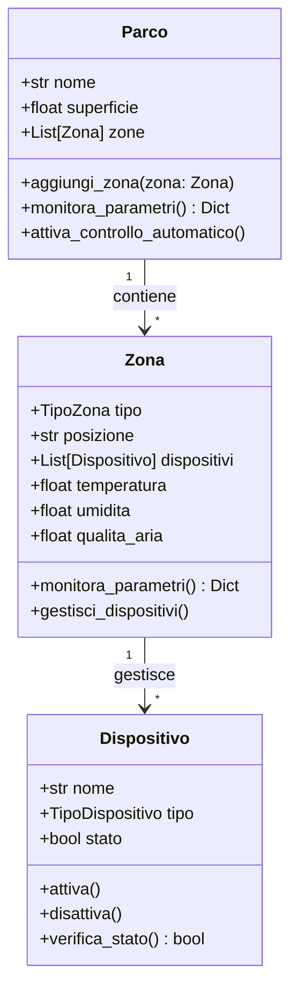

```mermaid
classDiagram
  class Parco {
        +str nome
        +float superficie
        +List[Zona] zone
        +aggiungi_zona(zona: Zona)
        +monitora_parametri() Dict
        +attiva_controllo_automatico()
    }

    class Zona {
        +TipoZona tipo
        +str posizione
        +List[Dispositivo] dispositivi
        +float temperatura
        +float umidita
        +float qualita_aria
        +monitora_parametri() Dict
        +gestisci_dispositivi()
    }

    class Dispositivo {
        +str nome
        +TipoDispositivo tipo
        +bool stato
        +attiva()
        +disattiva()
        +verifica_stato() bool
    }
   
    Parco "1" --> "*" Zona : contiene
    Zona "1" --> "*" Dispositivo : gestisce
```
