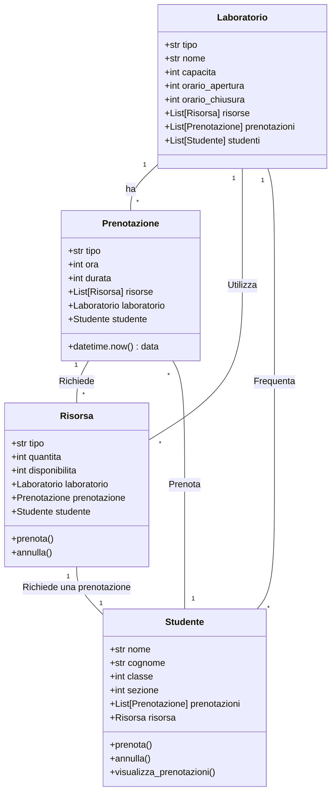

import datetime

```mermaid
classDiagram

class Laboratorio {
+str tipo
+str nome
+int capacita
+int orario_apertura
+int orario_chiusura
+List[Risorsa] risorse
+List[Prenotazione] prenotazioni
+List[Studente] studenti

 }

class Prenotazione {
+str tipo
+datetime.now() data
+int ora
+int durata
+List[Risorsa] risorse
+Laboratorio laboratorio
+Studente studente

    }

class Studente {
+str nome
+str cognome
+int classe
+int sezione
+List[Prenotazione] prenotazioni
+Risorsa risorsa
+prenota()
+annulla()
+visualizza_prenotazioni()
    }

class Risorsa {
+str tipo
+int quantita
+int disponibilita
+Laboratorio laboratorio
+Prenotazione prenotazione
+Studente studente
+prenota()
+annulla()

    }

Risorsa "1" -- "1" Studente: Richiede una prenotazione
Laboratorio "1" -- "*" Prenotazione: ha
Prenotazione "1" -- "*" Risorsa : Richiede
Studente "1" -- "*" Prenotazione: Prenota
Laboratorio "1" -- "*" Risorsa: Utilizza
Laboratorio "1" -- "*" Studente: Frequenta
```

