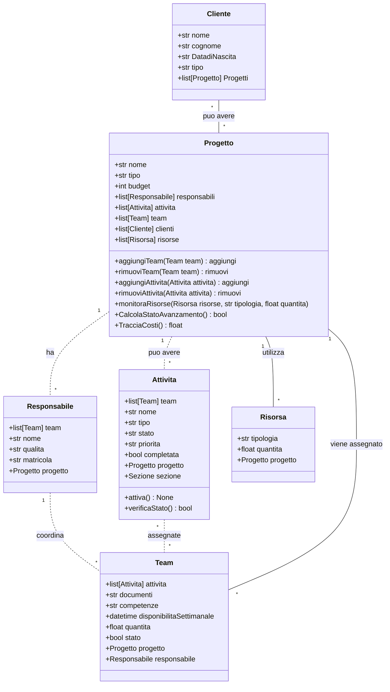

```mermaid
classDiagram
    class Progetto {
    +str nome
    +str tipo
    +int budget
    +list[Responsabile] responsabili
    +list[Attivita] attivita
    +list[Team] team
    +list[Cliente] clienti
    +list[Risorsa] risorse
    +aggiungiTeam(Team team) aggiungi
    +rimuoviTeam(Team team) rimuovi
    +aggiungiAttivita(Attivita attivita) aggiungi
    +rimuoviAttivita(Attivita attivita) rimuovi
    +monitoraRisorse(Risorsa risorse, str tipologia, float quantita) 
    +CalcolaStatoAvanzamento() bool
    +TracciaCosti() float
    }

    class Responsabile {
        +list[Team] team
        +str nome
        +str qualita
        +str matricola
        +Progetto progetto
    }

    class Cliente {
        +str nome
        +str cognome
        +str DatadiNascita
        +str tipo
        +list[Progetto] Progetti
    }

    class Attivita {
        +list[Team] team
        +str nome
        +str tipo
        +str stato
        +str priorita
        +bool completata
        +Progetto progetto
        +Sezione sezione
        +attiva() None
        +verificaStato() bool
    }

    class Team {
    +list[Attivita] attivita
    +str documenti
    +str competenze
    +datetime disponibilitaSettimanale
    +float quantita
    +bool stato
    +Progetto progetto
    +Responsabile responsabile
    
    }

     class Risorsa {
    +str tipologia
    +float quantita
    +Progetto progetto

    }

%%note:
%%task vale come attivita
%%l'azienda non è necessaria perchè una
%% qualita in Responsabile è inteso come qualifica quindi quanto è bravo
%% classe Team intesa anche come i membri del team
%% bool stato intende se il team lavora o è inattivo
%% str tipo in Cliente indica se è un cliente abituale o no
Progetto "1" .. "*" Responsabile : ha
Responsabile "1" .. "*" Team : coordina
Progetto "1" .. "*" Attivita : puo avere
Attivita "*" .. "*" Team : assegnate
Cliente "*" -- "*" Progetto : puo avere
Progetto "1" -- "*" Risorsa : utilizza
Progetto "1" -- "*" Team : viene assegnato
```